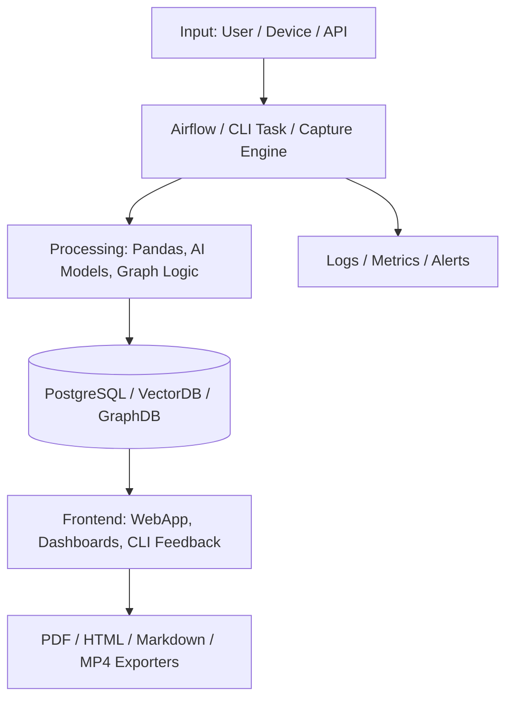

<div align="center">

# ⚡ Alvaro Arteaga — Ingeniero Eléctrico · Full‑Stack & AI Developer · Creative Technologist

### 🌿 a.k.a. **Artemio** — Orthodox Christian identity and creative signature


</div>

---

> 🧠 I am a Chilean electrical engineer and full‑stack developer specializing in building intelligent, high-impact platforms that combine backend, frontend, AI, systems programming and real-time data pipelines.
>
> My projects span energy analytics, embedded AI, network tools, formal computation, DSLs, and data visualization systems. I build robust software with strong architecture, ethical reasoning, and visual clarity.

---

## 🛠️ Tech Stack & Capabilities

```yaml
Languages:     [Rust, Python, TypeScript, JavaScript, C++, SQL, Markdown, WebAssembly]
Backend:       [Django, FastAPI, Actix, SQLAlchemy, GraphQL, gRPC, PostgreSQL, Neo4j]
Frontend:      [SvelteKit, React, Vue, D3.js, TailwindCSS, HTMX, UI Toolkit, ShadCN]
AI & ML:       [LangChain, llama.cpp, GPT-4o, ONNX, SBERT, SHAP, RAG, LoRA, Transformers]
Visualization: [WebGPU, D3.js, Three.js, Sankey, Gantt, Mermaid, Figma, CanvasKit]
DevOps:        [Docker, GitHub Actions, AWS EC2/S3/IAM, Fly.io, CI/CD Pipelines]
CLI & Tools:   [Tauri, Clap, ratatui, Rich, pest.rs, wasm-bindgen, Pyodide, MkDocs]
```

---

## 🎓 Selected Professional Projects (Work)

| 🏢 Project                 | Description                                                 | Stack                                      | Repo Link                                                                    |
| -------------------------- | ----------------------------------------------------------- | ------------------------------------------ | ---------------------------------------------------------------------------- |
| **BalanceDx 2025**              | Traceable energy distribution reconciliation and audit platform | Django • Airflow • Vue 3 • PostgreSQL • TimescaleDB • Docker | [🔗 Repo (Private)](https://github.com/CoordinadorElectrico/balance-dx-2025-GM)              |
| **Diferencias por Compra** | Automated calculation of Transfer Price Differences for regulated contracts in the Chilean electricity market. Structured, auditable and reproducible ETL system. | Python • Airflow • PostgreSQL • Docker • Power BI • YAML   | [🔗 Repo (Private)](https://github.com/CoordinadorElectrico/diferencias_por_compra) |
| **Armonización Tarifaria**     | -      | -            | [🔗 Repo (Private)](https://github.com/AlvaroArteaga/)     |

---

## 🎡 Personal R\&D Projects (Top 15)

> A portfolio of deep-tech explorations across software intelligence, real-time data, and visual computation.

| 🌐 Project              | Tech Highlights                                            | Repo Link                                                     |
| ----------------------- | ---------------------------------------------------------- | ------------------------------------------------------------- |
| **CodexInfra Ω**        | Next.js, React Native, GPT-4o, BLE/UWB, GraphQL, OpenCV    | [🔗 Private](https://github.com/AlvaroArteaga/codexinfra)     |
| **Lux Chromatica**      | Unity 6, ML Agents, NPR, Behaviour Trees, Shader Graph     | [🔗 Private](https://github.com/AlvaroArteaga/lux-chromatica) |
| **AetherGrid ⚡**        | C++23, Julia, WebGPU, SHAP, Transformers, Jupyter          | [🔗 Private](https://github.com/AlvaroArteaga/aethergrid)     |
| **AetherViz HyperNova** | WebGPU, Astro, ONNX.js, GPT-4o distil, Sankey, Heatmaps    | [🔗 Private](https://github.com/AlvaroArteaga/aetherviz-hypernova)      |
| **AetherCortex OS**     | Neo4j, LangChain, SBERT, LaTeX, Markdown, WebGPU           | [🔗 Private](https://github.com/AlvaroArteaga/aethercortex-os)   |
| **AstraForge Ω**        | PyTorch, Gym, Rust, Diffusion Models, Orbital Visual DSL   | [🔗 Private](https://github.com/AlvaroArteaga/astraforge)     |
| **QuantaDoc ML**        | Rust, Markdown, PDF export, symbolic validation, llama.cpp | [🔗 Private](https://github.com/AlvaroArteaga/quantadoc)      |
| **LogosFracta™**        | Rust, WGSL shaders, FFT, 3D fractals, Lisp-style syntax    | [🔗 Private](https://github.com/AlvaroArteaga/logosfracta)    |
| **AscendLedger ⁂**      | CLI, Rust, ratatui, Smartcore ML, ethical audit logic      | [🔗 Private](https://github.com/AlvaroArteaga/ascendledger)   |
| **HelixForge IQ™**      | Algorithm animation, ONNX, LoRA, Monaco, benchmark cockpit | [🔗 Private](https://github.com/AlvaroArteaga/helixforge-iq)     |
| **Cognivista™**         | DSL compiler, WebGPU, AST visualization, AI hints engine   | [🔗 Private](https://github.com/AlvaroArteaga/cognivista)     |
| **SymbioVerse OS**      | WebGPU, Graph DSL, Delta-CRDT, offline LLM                 | [🔗 Private](https://github.com/AlvaroArteaga/symbioverse)    |
| **SynchroVista**        | Rust concurrency tracing, WebGPU Gantt, ONNX detection     | [🔗 Private](https://github.com/AlvaroArteaga/synchrovista)   |
| **VeriMathix**          | SMT, Rust, WASM, D3.js trees, LLM proof explanation        | [🔗 Private](https://github.com/AlvaroArteaga/verimathix)     |
| **HoloPacket X**        | Network sniffer, Rust CLI, 3D WebGPU, anomaly detection    | [🔗 Private](https://github.com/AlvaroArteaga/holopacketx)     |

---

## 🪡 Systems Architecture Snapshot



---

## 📊 GitHub Insights

<details open>
<summary>🔍 Stats & Languages</summary>

<p align="center">
  
  
</p>
</details>

<details>
<summary>🏆 Trophies</summary>

<p align="center">
  
</p>
</details>

---

## 🚶️ Let's Connect

| Platform | Link                                                                   |
| -------- | ---------------------------------------------------------------------- |
| LinkedIn | [linkedin.com/in/alvaroarteaga](https://linkedin.com/in/alvaroarteaga) |
| Email    | [arteaga.alvaro@outlook.com](mailto:arteaga.alvaro@outlook.com)        |                                                          |

---

## 🔐 License & Disclaimer

> 🔒 Public work only. No confidential, employer-owned or proprietary code is included.
>
> 🙏 Crafted with excellence, purpose, and full-stack love.
>
> 🙏 *"The divine light is uncreated and eternal."*
