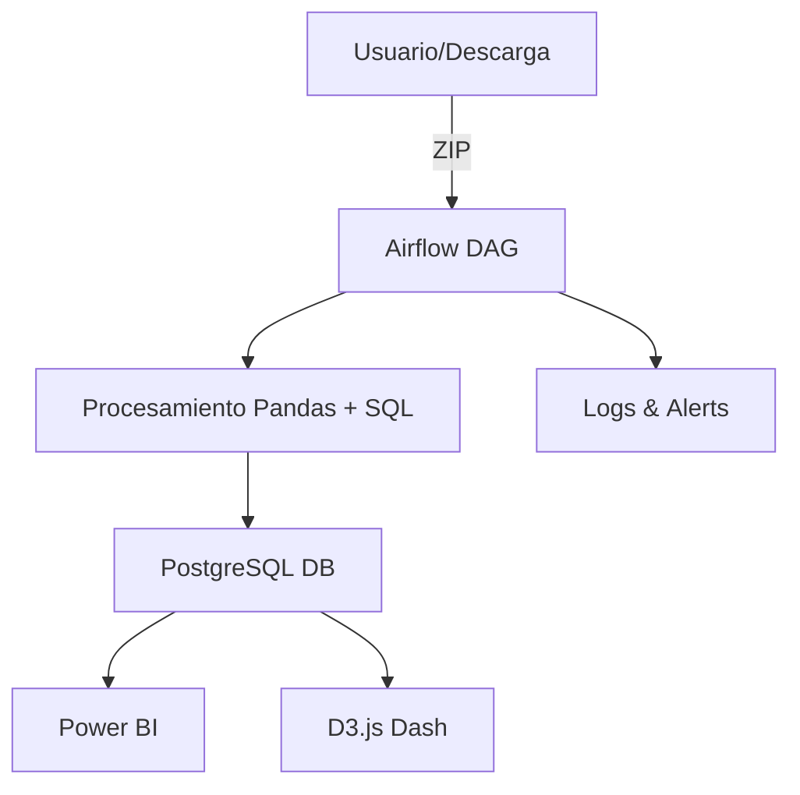

# ⚡ Alvaro Arteaga — Electrical Engineer · Full‑Stack & AI Developer · Creative Technologist

### a.k.a. **Artemio** — Orthodox Christian name and creative identity

> 🧠 I'm a Chilean electrical engineer and full‑stack developer who turns ideas into systems — from smart energy tools to creative apps, AI solutions, data pipelines and interactive dashboards.
>
> 🎯 My goal is to become a global leader in full-stack engineering, intelligent automation, and advanced data visualization — combining backend, frontend, AI, and real-time energy systems into world-class platforms.
>
> 🎯 I specialize in building full-stack, intelligent platforms — combining backend (Django, SQL, Airflow), frontend (Vue, D3.js), cloud (Docker, AWS), AI, and real-time data pipelines for energy, apps, and analytics.

---

## 🛠️ Tech Stack

| Category      | Tools                                                       |      |         |
| ------------- | ----------------------------------------------------------- | ---- | ------- |
| **Languages** | `Python` · `C++` · `TypeScript` · `JavaScript` · `SQL`      |      |         |
| **Back‑end**  | `Django` · `FastAPI` · `Flask` · `SQLAlchemy`               |      |         |
| **Front‑end** | `Vue` · `Vuetify` · `D3.js` · `HTMX`                        |      |         |
| **Data & AI** | `Pandas` · `NumPy` · `scikit‑learn` · `Power BI`            |      |         |
| **DevOps**    | `Docker` · `GitHub Actions` · \`AWS (EC2                    |  S3  |  IAM)\` |
| **Extras**    | `Kivy/KivyMD` · `PostgreSQL` · `Rich` · *Markdown Lover* 😎 |      |         |

📊 <strong>Technology Expertise Breakdown</strong>

| Area                     | Tools / Stack                                                                                        | Expertise Level |
|--------------------------|------------------------------------------------------------------------------------------------------|-----------------|
| **Backend**              | Python · Django · FastAPI · SQLAlchemy · PostgreSQL                                                  | ⭐⭐⭐⭐⭐           |
| **Frontend**             | Vue.js · Vuetify · D3.js · HTMX · HTML/CSS                                                           | ⭐⭐⭐⭐⭐           |
| **AI & Data Science**    | Pandas · scikit-learn · NumPy · AI pipelines                                                         | ⭐⭐⭐⭐            |
| **Visualization**        | D3.js (focus) · Power BI · Dashboards · Data storytelling                                            | ⭐⭐⭐⭐⭐           |
| **Automation & ETL**     | Apache Airflow · Webscraping · Scheduled pipelines                                                   | ⭐⭐⭐⭐            |
| **Cloud & DevOps**       | Docker · GitHub Actions · AWS (EC2, S3, IAM)                                                         | ⭐⭐⭐⭐            |
| **Geospatial & GIS**     | QGIS · GeoDataFrames · shapefiles · Blender · map automation                                         | ⭐⭐⭐             |
| **App & Game Dev**       | Kivy · JS frameworks · Game architecture · Blender · Asset pipelines                                | ⭐⭐⭐             |
| **Knowledge Graphs**     | Neo4j · Graph data modeling · Cypher                                                                 | ⭐⭐              |
| **Languages**            | Python · C++ · JavaScript/TypeScript · SQL                                                           | ⭐⭐⭐⭐⭐           |

---

## 🚀 Projects & Systems

| 🧩 Proyecto                | ¿Qué hace?                                                                            | Stack clave                                |
| -------------------------- | ------------------------------------------------------------------------------------- | ------------------------------------------ |
| **BalanceDx**              | Dashboard energético empresarial para vectores de energía y transferencias económicas | Django · Vue · D3.js · PostgreSQL · Docker |
| **Diferencias por Compra** | Pipeline Airflow que automatiza descargas S3, parsing y reporting regulatorio         | Airflow · Python · YAML · SQL · Power BI   |
| **S3 Bulk Downloader**     | CLI con MFA + parámetros dinámicos y reportes timestamped                             | Python · Boto3 · Rich                      |

---

## 🧠 Arquitectura típica de mis soluciones

---

## 📈 GitHub Stats

📊 Estadísticas y lenguajes más usados

  
  

🏆 GitHub Trophies

  

---

## 📚 Blog & Código Diario

🧠 Últimos artículos y progreso diario (auto‑update)

<!-- BLOG-POST-LIST:START -->

<!-- BLOG-POST-LIST:END -->

<!--START_SECTION:waka-->

<!--END_SECTION:waka-->

---

## 🤝 Contact

| Plataforma | Enlace                                                      |
| ---------- | ----------------------------------------------------------- |
| LinkedIn   | [in/alvaro-arteaga](https://linkedin.com/in/alvaroarteaga) |
| Kaggle     | [@AlvaroA](https://kaggle.com/AlvaroA)                      |
| Discord    | `Artemio#1234`                                              |

---

## 🔒 Privacy & Disclaimer

> 🔐 Only public metadata and open‑source projects are shown here. No proprietary, confidential or employer‑owned code is exposed.
>
> 👤 Opinions expressed are my own and do not necessarily represent my employer.

---

  <em>Built with 🧠, 🐍, and ☕ — advanced <strong>Markdown</strong> craftsmanship. Soli Deo Gloria.</em>

